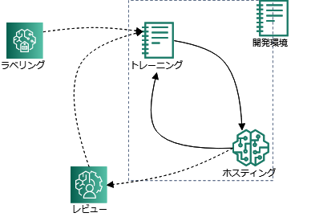
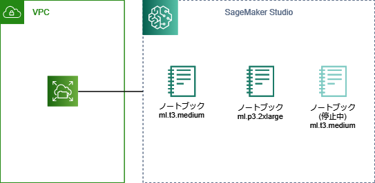
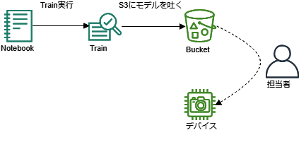
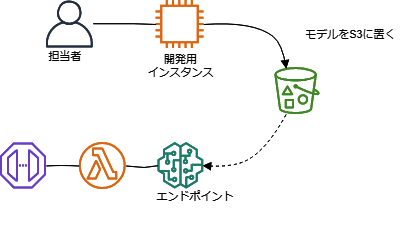
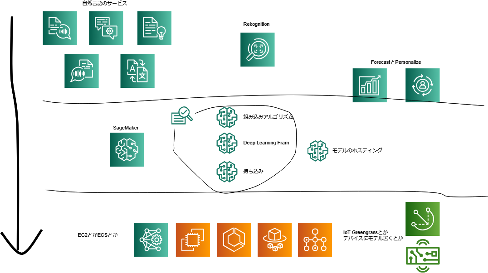
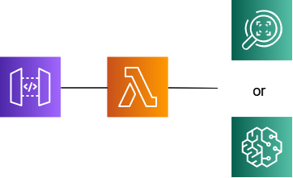
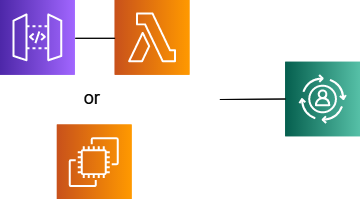
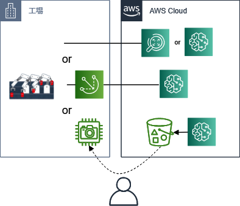

# 第1回 新SageMaker勉強会 機械学習系サービスと新SageMakerざっくり

## 第1回の目的

以下の内容を理解します。

- AWSのML系サービスにはどんなものがあるか？
- SageMakerとはどんなサービスであったか？
- どんどん増えるAWSのML系サービスの中でのSageMakerの位置づけは？
- どんなときにどのサービスを選択すればよいか？
- インフラという観点でSageMakerのどの機能を押さえておくべきか？

以下についてはお話しません。

- AI, 機械学習とは何か？
- 各サービスの具体的な仕様・利用方法

# 1. AWSのML系サービスおさらい

これを見てくれ

- [AWS での機械学習](https://aws.amazon.com/jp/machine-learning/)

2つに分けてるらしい。。。

|||
|---|---|
|AIサービス |その名の通り。APIでInputを与えると予測結果が返ってくる感じのサービス群。機械学習の知識がなくともアプリケーションに機能を追加できる。しかしサービス・機能によってはユーザーが学習データを用意する必要がある。|
|MLサービス|ユーザーが学習データを用意→トレーニング→ホスティングまでするサービス。どちらかというとデータサイエンティストのためのサービス。いまのところSageMakerだけらしい。|

## 1-1. AIサービス

APIを叩くと予測結果がが返るサービス。

### 1-1-1. 自然言語

商品レビューを分析したり、Alexa作ったりでここら辺は強いのかな？

Comprehendは多機能なので便利。

|サービス|概要|
|---|---|
|Amazon Comprehend|自然言語もろもろ|
|Amazon Transcribe|文字起こし|
|Amazon Translate|翻訳のやつ|
|Amazon Lex|チャットボット|
|Amazon Polly|読み上げ|
|Amazon Kendra（？）|ドキュメントの検索？|

### 1-1-2. 画像, 映像

Rekognitionは多機能なので便利

|サービス|概要|
|---|---|
|Amazon Rekognition|画像系もろもろ|
|Amazon Textract|OCRを機械学習で強化した感じのサービス|

### 1-1-3. その他便利機能
- Amazon CodeGuru
- Amazon Fraud Detector

## 1-2. AIサービスとMLサービスの中間

以下は個人的に中間に位置してる感じがする。

- Amazon Forecast
- Amazon Personalize
- Amazon SageMaker Autopilot

### 1-2-1. Forecast & Personalize

- それぞれ用途が限られている、レコメンドと時系列予測。
- レシピが用意されてる
    - レシピ: アルゴリズムとデフォのハイパーパラメータのセット
- AutoMLが使える

### 1-2-2. Amazon SageMaker Autopilot

かつてのAmazon Machine Learningの強化版。詳しくは次回。

# 2. SageMakerおさらい

これを見てくれ

- [Amazon SageMaker](https://aws.amazon.com/jp/sagemaker/)

## 2-1. SageMakerを分けてみてみる。。。

ざっくり以下の要素にわけられる

1. 開発環境
2. ラベリング
3. トレーニング
4. ホスティング
5. レビュー

それぞれ機械学習, AIの運用の各フェーズを担ってる。

しかし、重要な機能は1, 3, 4な感じ(個人の感想)

1-5に属する細かい機能もいっぱいある。それは今後の各論で。

それぞれ見てみる

### 2-1-1. 開発環境

SageMaker Studioと呼ばれるやつ。

特徴（詳しくは次回）

- マネージドなJupyterLab
- 起動が早い
- もろもろのライブラリがインストール済み
- ボリュームがEFS

などなど

SageMaker Studio上でデータを前処理したり、↓で説明するトレーニングやホスティングの実行したりする感じ。

ただし料金については気をつけないといけない。

- ノートブックごとにインスタンスが立ち上がり、SageMaker Studio上でShutdownするまで課金

IAMユーザー払い出し・ライブラリインストールの手間はかかるが、トレーニングやホスティングの実行だけならローカルやGoogleColaboratoryでもできなくはないとお考えか？SageMaker StudioはAWS SSOが使えるし、Studio自体にIAMロールがつくよ（詳しくは次回）

### 2-1-2. 学習データのラベリング

Groud Truth

- S3に保存したデータをラベリングするための画面が用意されてる。

- ラベリングする人員はMechanical Turk, サードパーティ, プライベートが選べる。

### 2-1-3. モデルのトレーニング

SageMakerの主要な機能の1つ。

マネージドなインスタンスを使ってモデルの学習ができるので、ほとんどインフラを気にする必要がない。

インスタンスは「トレーニングジョブ」ごとに立ち上がり、ジョブが完了するとモデルやら関連するファイルがtar.gzでS3に吐かれる（モデルアーティファクト）。インスタンスは勝手に停止する。ユーザーは実行したら待ってればよい。

インスタンスと言ってるけど、Dockerで動いてる。

- 組み込みアルゴリズムと呼ばれるAWSマネージドなアルゴリズムが用意されてる。

- トレーニングで利用できるディープラーニングフレームワークを含んだマネージドなDockerイメージも提供されてる。TensorFlowとかPytorchとか。
- 独自のDockerイメージを用意するればアルゴリズムを持ち込むこともできる。

ExperimentやDebugger, ハイパーパラメータ調整などの便利機能もある。

- SageMaker Tuning: 最善なハイパーパラメータの探索。
- Sagemaker Experiments: トレーニングしたモデルを整理, 比較, 評価。
- SageMaker Debugger: トレーニング実行中のモデルの状態を記録。

詳しくは今後の各論で。

### 2-1-4. モデルのホスティング

SageMakerの主要な機能の1つ。

マネージドなインスタンスを使って "モデル" のホスティングできるので、ほとんどインフラを気にする必要がない。

ちなみにSageMaker用語の "モデル" とは？
- 一般的なモデルとはちょっとちがう
- モデルアーティファクトの場所とイメージを指定した設定情報のこと

ただしエンドポイントは停止ができない。

インスタンスと言ってるけど、Dockerで動いてる。

- エンドポイントを叩くと推論結果が返って来る。

- トレーニングと同じく、組み込み, DeepLearning image, イメージの持ち込みが¥利用できる。
- イメージ持ち込みの場合は、REST APIを用意する必要がある。

便利機能も多数

- Multi Model Endpoints: モデルを複数配置。A/Bテストのようなことも。
- Model Monniter: 推論時に受け取るデータの監視。
- バッチ変換: データをためておいてバッチで推論をかける。名前がわかりづらい。
- 推論パイプライン: 推論を組み合わせてパイプラインぽくできる。
- SageMaker Neo: モデルのコンパイル。

詳しくは今後の各論で。

### 2-1-5. レビュー

Argumented AI

- あやしい予測結果を人力でレビュー
- GroundTruthみたいなやつ

## 2-2. SageMakerは誰が使うのか？

データサイエンティストがインフラを気にしなくていい的なサービス。

- 学習を実行するサーバーはどう用意しようか？。
- モデルを作成した後のAPIの用意ってそもそもワテらの仕事？

とか。

データサイエンティストはトレーニングやモデルの作成に集中しましよう

という考え方のサービス。

[Amazon SageMaker Python SDK](https://sagemaker.readthedocs.io/en/stable/)というのがありStudio上でだいたいの機能は利用できる。

とりあえずS3にデータが突っ込んであれば、ごにょごにょしてトレーニングも実行できる。しかもSDKでエンドポイントもすぐに作れちゃう。

エンドユーザー向けサービスなのか、[ドキュメント](https://docs.aws.amazon.com/ja_jp/sagemaker/latest/dg/whatis.html)と[サンプル](https://github.com/awslabs/amazon-sagemaker-examples)が充実してる。

## 2-3. 全て利用しないといけないわけではない

SageMakerでトレーニングしたモデルとそれに関連するファイルはS3に吐かれる, 吐くことができる。そのためこれを別のところに持っていくことも可能。

- 例: SageMakerでトレーニング, デバイスにモデルを置いておく。

モデルのホスティングではS3に置いたモデルアーティファクトを指定する。つまり別の環境でトレーニングしたモデルをS3に置けばホスティングのみも可能。

- 例: EC2でトレーニング, ホスティングはSageMakerを利用。

もっと言うとAWS Marketplaceにアルゴリズムやモデルは売ってる。
- お金払えば、自分たちでコード書いたり、モデルをトレーニングしたりが不要になるかも。。。

つまり
- マネージドなので、トレーニング~ホスティングまでSageMakerでいいように思える。
- 要件によってはトレーニングのみSageMakerということもある。もしくはホスティングのみSageMakerというのもできる。
- そもそもMarketplaceで見つけてくるだけでよいかも

## 2-4. SageMakerだけで完結するわけではない

SageMakerのみでやるとしても。。。

- 学習データ, モデルはS3に置く
- ホスティングしたエンドポイントを叩くLambdaとかを用意。

などなど。

MLOps的な話で自動化しようと思うと。。。

- Airflow, KubeflowはSDKで使える。
- Code兄弟でがんばる？

# 3. どのサービスをつかおうか？

## 3-1.考えてみよう

1. ある企業は画像から物体検出をするアプリケーションを開発しようとしています。どのAWSサービスを使うとよいでしょう？
2. ある企業は運営する動画配信サイトにユーザーに対するレコメンデーション機能を追加したいと考えています。どのAWSサービスを使うとよいでしょう？

3. ある企業は自社の工場で画像認識で検品する仕組みを作りたいと考えています。どのAWSサービスを使うとよいでしょう？
4. ある企業は経営する700店舗のレストランの売上を店舗ごとに予測したい。どのAWSサービスを使うとよいでしょう？

## 3-2. どのサービスを使うか？

マネージドな順から考える。

- AI/MLサービスに限ったことではないが、マネージドサービスで間に合うならどんどんそれを使う。

トレーニングとモデルのホスティングの要件は別個で考えてよい。

忘れてたけどKinesisやQuickSightでもちょっとしたことはできる。

 EC2は最終手段。
エッジでの推論はGreengrassやデバイスに入れることも候補に入る。
（ちょっと話がそれるが、ロボティクスの話ならRoboMakerも）

↓な感じ。

- ちょっとした分析, 推論であればAIサービスで足りる。
    - ちょっとしたカスタムもできる。Rekognition, Comprehend
- ネジはネジでも良品/不良品を分けるならRekognitionでは対応できないかも。。。
- 推論で低レイテンシーの要件があればSageMakerでもムリかも。。。

- 実際にやってみないとわからないのでPoCは必要。PoCで終わるかもしれないが。。。

### 参考: AI/機械学習プロジェクトに必要な3要素

以下3つのうちどれか不足するとだいたい失敗するらしい。。。

- 課題
- 解決策
- データ

## 3-3. 例の答え合わせ

答え合わせというか考え方。
とりあえず提案段階, PoCとして考えてみる。

1. 検出したいのは何か？？リアルタイムで検出したいか？？どんな粒度で検出したいか？？一般的な"物"ならRekognitionでもいいが。。。ダメそうならSageMakerで。。。

2. まあ一旦、Personalizeで考えるか。。。

3. 検品なのでRekognitionのカスタムラベルは無理かも。トレーニングはSageMakerかな？レイテンシーの要件で推論はSageMakerでも無理かも。。。

4. 時系列予測といえばForecastだけど、700店舗のデータを個別でForecastで学習させるのか。。。

# 4. インフラ担当から見たSageMaker

インフラ担当から見た、というかリセラーから見た、CIerから見たというべきか。。。

## 4-1. インフラ周り

- インスタンス立てたりとかは必要ない。
- ネットワークの管理がほぼない。VPCに接続とかしなければ。
- IAMの管理は必要。IAMロール, AWS SSOも。

SageMakerはデータありきのサービスなので、もしないならデータを集めるための構成や仕組みは別途考える必要がある。

## 4-2. 料金

料金の話でいうと、気にすべき機能は↓。インスタンスが立ち上がる。（もちろんGroudTruth, Argumented AIでも何かしら料金かかるが...）

- SageMaker Studio
- Processing
- トレーニング
    - パラメータ調整ジョブ含め
- ホスティング

ちなみにProcessingとは？
- その名の通り何かの処理に使う。前処理とかモデルの評価とか。

マネージドなサービスなので料金は通常のEC2インスタンスより割高。

ホスティングではエンドポイントが立ち上げっパになるので料金がかかり続ける。

料金をケチって別の構成を取るのもいいが、だいたいはSageMakerでいいとオモウ。

## 4-3. 運用

インスタンスはマネージドなのでよっぽどの要件でなければインフラの監視, 運用, 保守は不要。

前述したとおりMLOpsとか自動化とかを考えるとSageMakerでは足りないことがあるのか？Airflow, Kubeflowは使えそうだが。。。

Code兄弟つかうとかなら、何かしないといけないかも

# 5. まとめ

- SageMakerはデータサイエンティスト向けのサービス、インフラ担当が出る幕はほぼない。
- ただ他のサービスとの接続・統合を考えると何かしらしないといけない。

# 6. アンケート

次回はSageMaker Studio & Autopilotの予定です。

SageMaker勉強会の改善のため、下記のアンケートにご協力お願いいたします。

- [アンケート](https://forms.gle/pu1Jzr8BCn1x77fj7)