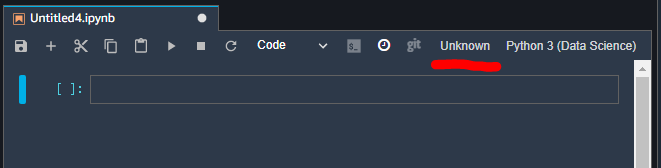
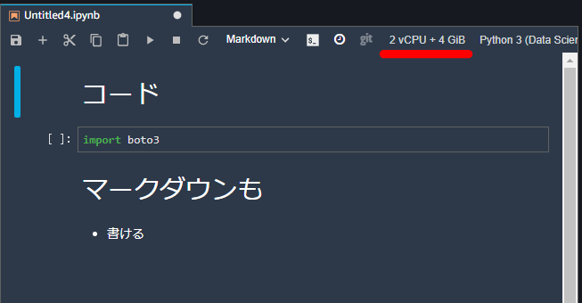

# 第2回 新SageMaker勉強会 SageMaker StudioとAutopilot

## 第2回の目的

以下の内容を理解します。

- SageMaker Sutdioとは何か。
- SageMaker Studioを構築する。
- Autopilotとは何か。
- Autopilotを利用してAutoMLを実践する。

SageMaker StudioとSageMaker Autopilotについては[AWS AI/ML@Tokyo #4](https://aws.amazon.com/jp/blogs/news/aws-aiml-tokyo4/?utm_source=feedburner&utm_medium=feed&utm_campaign=Feed%3A+aws%2Fjp-blog-news+%28Amazon+Web+Services+%E3%83%96%E3%83%AD%E3%82%B0%29)にて省かいとデモが実施されました。

デモ動画『[MLサービス - Amazon SageMaker](https://youtu.be/OyH9rNg81s4?t=600)』

今回の勉強会・ハンズオンは上記でも紹介されていないことにも触れます。

# 1. SageMaker Studio

## 1-1. SageMaker Studioとは？

[公式の資料の](https://pages.awscloud.com/rs/112-TZM-766/images/1.AWS%E3%81%AEAIML%E3%82%B5%E3%83%BC%E3%83%92%E3%82%99%E3%82%B9%E6%9C%80%E6%96%B0update.pdf)の17~19ページに記載。

- ブラウザでアクセスするSageMakerのための統合開発環境
    - 前処理, トレーニング, デプロイ, 分析
- 自称「JupyterLabのインターフェイスを拡張」された開発環境なので、すんなり使える。
    - JupyterLabにSageMakerの各機能が追加されてる感じ。

- AWS SSOが使える。
    - データサイエンティストはマネコンを経由せずにSageMaker Studioの画面へログイン可能（= アカウントの管理者はIAMの管理やデータサイエンティストにマネコンを見せなくて済む）

- これまでマネコンやSDKで実行した機能や新機能がSageMaker StudioのGUIでも実行できる
    - SageMaker AutopilotによるAutoMLの実行
    - SageMaker Experimentsによるモデルの比較
    - モデルのデプロイとModel Moniterによる監視

- ホームディレクトリがEFS。
    - 他のリソースからもアクセスできる。EC2からマウントする等。

### ちなみにJupyterLabとは？

- Jupyter Notebookはコードとその説明、実行結果をまとめて書けるファイル
    - インタラクティブに実行できるのでデータ分析などで便利
- [JupyterLab](https://jupyterlab.readthedocs.io/en/stable/index.html)はJupyter Notebookを利用するための環境
    - ターミナルも使えるし、ふつうにコードも書ける。

## 1-1-1. SageMaker Studio Notebooks
- SageMaker Studioで利用するJupyter Notebook
    - ファイルの編集は通常のJupyter Notebookと変わらない。

- Notebookを開く/作成するとき[カーネル](https://docs.aws.amazon.com/ja_jp/sagemaker/latest/dg/notebooks-available-images.html)と[インスタンスタイプ](https://docs.aws.amazon.com/ja_jp/sagemaker/latest/dg/notebooks-available-instance-types.html)が選択できる。
    - カーネル: Notebookのコードを実行するは何か(？)。いまのところSageMaker StudioではPython3のみだがカスタム可能。

        - カーネルを停止しなけばオブジェクトが保持される（=メモリが使われ続ける）。 
    - イメージ: ↑の最新のカーネルと最新のSageMaker Python SDK, もろもろのフレームワークの組み合わせたイメージ。
    - インスタンス: Notebookでコードを実行するときに裏側で立ち上がるインスタンス。
- 上記な仕組みなので課金体系が謎。
    - イメージ + インスタンスタイプの組み合わせでインスタンスが立ち上がる。
    - [ドキュメント](https://docs.aws.amazon.com/ja_jp/sagemaker/latest/dg/notebooks-usage-metering.html)によると↓。
    >同じインスタンスタイプで複数のノートブックを開くと、異なるカーネルを使用している場合でも、ノートブックは同じインスタンスで実行されます。その 1 つのインスタンスが実行されている時間に対してのみ課金されます。


## 1-2. ハンズオン: SageMaker Studioの利用

### 1-2-1. SageMaker Studioの作成

SageMaker Stuidoを開くまで実施します。

#### SageMaker Studioの画面を開く

ユーザー名とIAMロールを入力。送信をポチッ。


#### 待ち

待ちます


#### 開く

開く


### 1-2-2. SageMaker Studio Notebookの利用

LauncherからNotebookを開き、シャットダウンまで実行します。

#### Notebookを開く

- イメージは ```Data Science``` を選択する。
    - 他にもいろいろあるがだいたい ```Data Science``` で間に合う。
    - GPU最適化イメージを選択するとGPUインスタンスが立ち上がるので注意。
- Notebookの ```Python 3``` をクリック。


- ノートブックが開く。スペックが ```Unknown ``` なので少しまつ。
    - 開いた直後はインスタンスが起動してないので何も実行できない。 



- スペックが見えたら利用可能
    - 適当にコードを入力して ```Ctrl``` + ```Enter``` もしくは ```Shift``` + ```Enter``` で実行できる。
    - マークダウンも書ける。



#### スペックの変更

- スペックの表示をクリックすると変更できる。
    - 基本的には最小でok。
    - Fast Launchのものとそうじゃないものがある
    - 変更するとオブジェクトやインストールしたパッケージは失われる。


#### カーネルの変更

- カーネルも変更できる。


#### シャットダウン

- ```Running Terminals and Karnels``` から起動中のターミナル・カーネル・イメージが確認できる。


- ```ShUT DOWN``` で停止。
    - イメージを停止すると課金は止まる。


# 2. SageMaker Autopilot

## 2-1. SageMaker Autopilotとは？
- いわゆるAutoMLな機能。

    - 前処理, トレーニング, チューニングを自動でやってくれる。
- SageMaker Studioからほぼコード無しで実行できる。
    - 機械学習の知識がほぼ無くても実行できる。
    
    - もちろんコードでも実行できる。

### 2-1-2. Autopilotでできること

以下のことをユーザーにかわり実行する。つかっていくとわかるがAutopilotはSageMakerのいくつかの機能がラップされている感じ。特にSageMaker Experiments。

- 自動で前処理、特徴量エンジニアリング（= SageMaker Processiing）
- 自動でアルゴリズムの選択、学習
- 自動チューニング（= SageMaker Tuning）
- モデルの整理・比較（= SageMaker Experiments）


ユーザーはAutopilotの実行結果を見て任意のモデルをデプロイすることができる。

AutoMLな機能とは言え、いまのところAutopilotのできることは限られている。

- 線形回帰
- 二項分類
- 多項分類

また学習データにも制約がある。いまのところ。

- カンマ区切りの表形式のデータ。ようはCSVのみサポート。
- 小さすぎるデータセットでは実行できない。1000レコード以上のよう。（SageMaker Experimentの制約かも？）

つかって見た感じ、SageMakerの各機能をラップしたような機能で、できることはまだまだ限られている。機械学習に詳しくなくAutoMLで実行したいとかであれば、Datarobotのようなサードパーティのサービスを使うのがよいと思う。

#### 線形回帰

ある数値からある数値を予測する。

#### 二項分類

True/Falseみたいな話、コロナ陽性か陰性かとか

#### 多項分類

多クラスの分類。イヌかネコかタコか、など。

## 2-2. ハンズオン: コードなしでSageMaker Autopilotを使おう！

### 2-2-1. ターミナルでリポジトリをクローン

SageMaker Studio上でターミナルを開き、このリポジトリをクローンします。

#### ターミナルの起動

- Launcherからターミナルを起動。


#### リポジトリをクローン

```
$ git clone　hogehoge
```

### 2-2-2. ノートブックを起動

- ハンズオン用のノートブックを開きます。

- あとはノートブックの内容にしたがってください。

# 3. まとめ

# 4. アンケート

勉強会改善・ネタの考案のためアンケートに回答ください。

- https://forms.gle/BEBJTUdcwv7pcZpq9